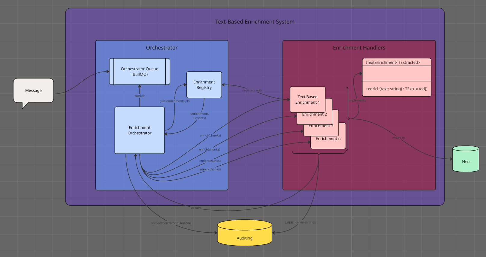
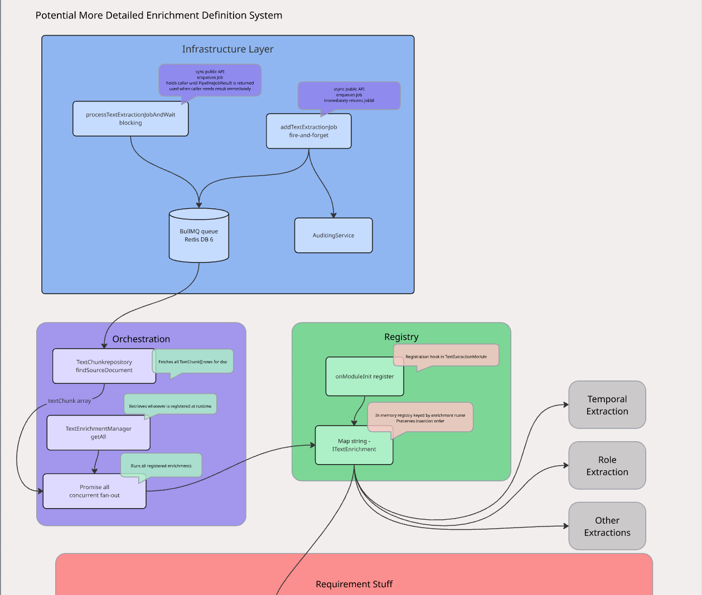
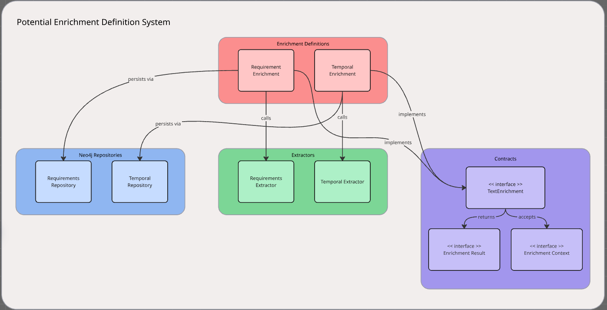

# My Notes for James

This file is read by the Jamesian agent at the start of each session.
Write anything here you want James to be aware of: meeting notes, observations while developing, architectural decisions already made, context about the project.

The Jamesian agent will never modify this file.

---

<!-- Add your notes below -->
### Date: 22 March 2026
**Post Meeting Notes**

**Meeting Notes:**
- Big believer in composition (over inheritance?)
- Orchestrator doesnt know what to do but it knows how to get enrichments
	- knows hows to get the right template
- Template that knows what to do 
	- List of how to do enrichment?
	- Describes the process 
- Manager to decide what is going to be run, Orchestrator to run the things
- Orchestrator doesn't do any of the work
- Orchestrator is for every enrichment
- Templates:
	- Text enrichment template
	- Mess with nodes template
	- I get an enrichment, but to do it, i need to do a text enrichment and a mess with nodes enrichment
- Registry Notes:
	- Tenant ID to identify client
	- Need a table in the database for tenantId -> defines what to extract, neo queries and stuff too
	- Whenever an enrichment appears, the UI is able to use the enrichments
- Consider cache-y system or lazy load system
- Types of enrichments:
	- Common enrichments: like glossary
	- Customer specific: like drugs
	- Custom: who knows
To-Do:
- branch off auditing for cleanup, testing, and requirements
- look into just starting again for the enrichment system?
	- start a new server dedicated to concepts we've talked about

**Pre-Meeting Notes:**
Jobs of each component:
- Orchestrator Queue: Holds jobs for the orchestrator to handle
- Orchestrator handles jobs via BullMQ workers (just like every other enrichment)
- Orchestrator Module has:
	- Queue Service (like other enrichments)
	- Orchestrator (below)
	- Registry (below)
	- Module (as all modules do)
- Orchestrator:
	- Asks the Registry for the enrichments
	- Runs enrich(chunks) on each of the enrichment handlers that are registered
		- "fans out" to each enrichment
	- Receives the results from each enrichment
	- Logs results to auditing system
		- success if received results from each enrichment
		- fail if missing result (talk about how to handle errors)
- Registry:
	- Where enrichments register to be used by enrichment orchestrator
- Enrichment Handlers: (service + extractor)
	- Service implements interface
	- Service handles milestone creation
	- Service handles neo interactions
	- Extractor does the fancy extration stuff on text
- Interface:
	- Defines what enrichment services need to implement and what is expected as input and output

-------------------------------------------------------

### Date: 21 March 2026
Currently have two primary open issues with James:
#### 1) BIG. The Enrichment Definition / Enrichment Pipeline system. 
- We have enrichments that will be essentially starting off with the same steps: referencing a document, getting all the text chunks, and then performing a task on these text chunks.
- The two steps: referencing a document and gathering the text chunks can then be taken away from the enrichments that use this system, which should make the enrichments simpler for the next person who wants to develop an enrichment like this.
	- sample extra enrichments would be like extracting all the job titles from text, or drug names. We have no plan to do this right now.
- James says this needs to use some kind of an interface which would define the functions that each of these would use. I think this would be something like:
	- parsing the text: takes in the text, performs its job (such as extracting all temporal entities)
	- writing to neo: writes whatever nodes to Neo (such as all the requirement nodes)
	- then, whatever other functions are necessary are just local to that one extractor?
- the actual extractions don't matter right now, and we don't erally care about them. The architecture is what is most important
- The current implementation is just a broad-stroke first pass which I am not happy with or proud of
- The enrichments should register with whatever EnrichmentRegistration system I put in place, they should not be explicitly called from the pipeline
	- The pipeline should somehow iterate over all registered enrichments
- I need to have a diagram and a small example for my meeting tomorrow
- I have two diagrams that are not exactly correct:

-------------------------------------------------------

##### Notes on Architecture:
- Terminology:
	- Text-Orchestrator module: The module which handles the text-based enrichments.
	- Registry: Where enrichments register to be run via the orchestrator
	- Text Enrichment Handler: The enrichments that are run via the text-orchestrator
	- Extractor: What actually performs action on text
- Orchestrator:
	- Gathers the text chunks
	- Handles the queue
	- Runs the enrichments
	- Maybe writes to Neo
	- Contains files like: 
		- orchestrator.service.ts: where the orchestration happens, the main class for geting the text, running the handlers, etc 
		- orchestrator.registry.ts: where the handlers register to be handled by the orchestrator 
		- orchestrator.module.ts: module file
- Registry: 
	- Where the enrichments that are run by the orchestrator are registered at run time
	- What this means, I have no idea
	- Definitely need to get an understanding of how this works
	- Contract looks something like "here's a source ID, do your enrichment, tell me whether you succeeded."
- Enrichment Handler
	- Houses the bits for the text enrichments, such as the extractor
	- Implements the interface agreed on by all the enrichments
	- Contains files like: 
		- temporal.service.ts: where the interface is implemented
		- temporal.extractor.ts: where the temporal entity extraction from the text takes place
- Extractor
	- Does the darn thing. Gets whatever is needed from the text for the enrichment.
- Questions
	- What does the interface look like?
	- Who writes to Neo? 
		- If orchestrator, means less calls to neo in the code, but also means more headache as to HOW to write to neo.
		- If handler, more Neo calls but no headache of stateless states
	- What is each elements defined role?
	- What is the shape of each module?
- Diagram of architecture thus far:

-------------------------------------------------------

-------------------------------------------------------
#### 2) SMALL. The Testing System.
- I implemented a really crappy and quick testing suite for each module. 
- I need to be able to explain this testing system
	- What the coverage report means
	- Where its lacking
	- Why it's done how I did it
- Essentially I just need to explain and have like a 15 minute conversation about what it means
##### Notes on testing: 
**Lines:** Physical code lines
**Statements:** From semicolon to semicolon
**Branches:** Every statement that leads to two different outcomes (ternary operators, if/else/try-catch/etc)
**Functions:** Actual literal fuctions
**Coverage Notes:**
- I made "happy path" testing for at least some modules, losing out on null values and such
	- if its worthwhile, I can look into this
- tests folders don't have 100% coverage bc coverage is determined by if the parts of the file are referenced in the spec files
- Intent vs Behavior testing:
	- I did behavior testing
	- This thing does this, so write test
